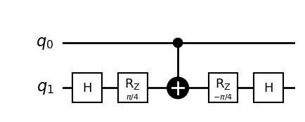
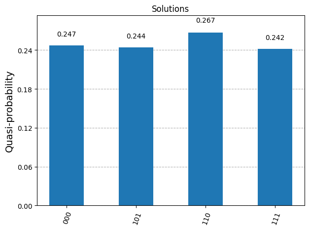

# GALA-*n* Quantum Library


GALA-*n* is a quantum library of **Generic Architecture of Layout-Aware *n*-bit gates**. GALA-*n* quantum library is proposed for cost-effective quantum gates transpilation, based on the layouts and the number of *n* neighboring physical qubits for IBM quantum computers, where *n* >= 3 qubits. All *n*-bit gates of GALA-*n* quantum library are designed using the geometrical approach of the Bloch sphere, based on the visual representations of the rotational quantum operations for IBM single-qubit basis gates (X, √X, and RZ) and IBM double-qubit basis gate (CX or ECR). In other words, the Bloch sphere is utilized in the GALA-*n* quantum library as a **geometrical design tool**, through the utilization of the XY-plane (the top-view of the Bloch sphere) as illustrated below.

")

GALA-*n* quantum library has a set of cost-effective *n*-bit gates, including:

* ***n*-bit Boolean gates:** AND, NAND, OR, NOR, implication, and inhibition gates, where *n* >= 3 qubits.
* ***n*-bit Fredkin gates:** controlled-SWAP (CSWAP) gates, where *n* >= 3 qubits.
* ***n*-bit Miller gates:** quantum distance gates, where *n* >= 3 qubits.
* ***n*-bit controlled square-root of Pauli-X (X) gates:** controlled-√X (as controlled-V) and controlled-√X† (as controlled-V†) gates, where *n* >= 2 qubits.

The cost-effectiveness of these *n*-bit gates of GALA-*n* quantum library comes from the following essential configurations:

1. All control qubits of an *n*-bit gate are only connected to the target qubit, without any mutual connection among them. For instance, all control qubits are connected to a target qubit using Feynman (CX) gates.
2. The target qubit of an *n*-bit gate can be replaced with any of the control qubits. For instance, the target qubit can be mapped in the middle among the control qubits, to fit the layout of an IBM quantum computer efficiently.
3. Based on (1) and (2), SWAP gates are no longer required to connect the non-neighboring physical qubits of an IBM quantum computer for the final transpiled *n*-bit gates.

Experimentally, from the above-mentioned essential configurations, the final transpiled quantum circuits constructed from *n*-bit gates of GALA-*n* quantum library always have lower quantum costs and fewer depths than those constructed from standard *n*-bit quantum gates, e.g., *n*-bit Toffoli and *n*-bit Fredkin gates, for IBM quantum computers.

For more information about the GALA-*n* quantum library and our introduced Bloch sphere approach, please read our paper entitled **"GALA-*n*: Generic Architecture of Layout-Aware *n*-Bit Quantum Operators for Cost-Effective Realization on IBM Quantum Computers"**, available at https://doi.org/10.48550/arXiv.2311.06760

## Installation

Install the latest version of the GALA-*n* quantum library using the `pip` command:

```bash
pip install git+https://github.com/albayaty/gala_quantum_library@main
```

Instead, the GALA-*n* quantum library can be manually installed as stated in the following steps:

1. Download this repository to your computer, as a ZIP file.
2. Extract this file to a folder, e.g., `gala_quantum_library`.
3. Use the `terminal` (or the `Command Prompt`) to `cd` to the `gala_quantum_library` folder.
4. Install the `setup.py` file using the following command:

   ```bash
    python setup.py install
    ```
    Or, using this command:

    ```bash
    python3 -m pip install .
    ```

## Usage

First of all, please be sure that the following prerequisite packages have been installed:

- [X] `qiskit` (version >= 1.0).
- [X] `qiskit_aer` (simulating quantum circuits locally).
- [X] `qiskit_ibm_runtime` (transpiling and executing quantum circuits on IBM quantum computers).
- [X] `qiskit.visualization` (plotting histograms, distributions, etc.).
- [X] `numpy` (mathematical constants and calculations).
- [X] `matplotlib` (drawing quantum circuits).

Next, the GALA-*n* quantum library consists of four callable functions as follows.

1. ***n*-bit Boolean gates:** (*n* >= 3 qubits)

    ```python
    GALA_Boolean(n, gate="AND", as_block=False, statistics=False)
    ```

    Where,

    `n`: the total number of qubits (*n*-1 controls and 1 target),
    
    `gate`: the name of an *n*-bit Boolean gate: `"AND"` as the default gate, `"NAND"`, `"OR"`, `"NOR"`, `"IMP"` as the implication, or `"INH"` as the inhibition,
    
    `as_block`: construct a gate as a quantum circuit or a block, its default value is `False`, and

    `statistics`: print the final counts of H, RZ, and CX gates, as a final quantum cost.
    
    The `GALA_Boolean` function returns the *n*-bit Boolean gate of GALA-*n* as a quantum circuit or a block. Note that the target qubit is the last indexed qubits in the *n* qubits.

2. ***n*-bit Fredkin gates:** (*n* >= 3 qubits)

    ```python
    GALA_Fredkin(n, as_block=False, statistics=False)
    ```

    Where,

    `n`: the total number of qubits (*n*-2 controls and 2 targets),
    
    `as_block`: construct a gate as a quantum circuit or a block, its default value is `False`, and

    `statistics`: print the final counts of H, RZ, and CX gates, as a final quantum cost.
    
    The `GALA_Fredkin` function returns the *n*-bit Fredkin gate of GALA-*n* as a quantum circuit or a block. Note that the target qubits are the last two indexed qubits in the *n* qubits.

3. ***n*-bit Miller gates:** (*n* >= 3 qubits)

    ```python
    GALA_Miller(n, as_block=False, statistics=False)
    ```

    Where,

    `n`: the total number of qubits (*n*-1 controls and 1 target),
    
    `as_block`: construct a gate as a quantum circuit or a block, its default value is `False`, and

    `statistics`: print the final counts of H, RZ, and CX gates, as a final quantum cost.
    
    The `GALA_Miller` function returns the *n*-bit Miller gate of GALA-*n* as a quantum circuit or a block. Note that this gate has *n* output qubits.

4. ***n*-bit controlled square-root of X gates:** (*n* >= 2 qubits)

    ```python
    GALA_CSX(n, gate="CSX", as_block=False, statistics=False)
    ```

    Where,

    `n`: the total number of qubits (*n*-1 controls and 1 target),
    
    `gate`: the name of an *n*-bit controlled square-root of X gate: `"CSX"` for the *n*-bit controlled-√X (controlled-V) gate as a default, or `"CSXdg"` for the *n*-bit controlled-√X† (controlled-V†) gate,
    
    `as_block`: construct a gate as a quantum circuit or a block, its default value is `False`, and

    `statistics`: print the final counts of H, RZ, and CX gates, as a final quantum cost.
    
    The `GALA_CSX` function returns the *n*-bit controlled square-root of X gate of GALA-*n* as a quantum circuit or a block. Note that the target qubit is the last indexed qubits in the *n* qubits.

Various *n*-bit gates of GALA-*n* quantum library can be constructed for specific Boolean and Phase purposes, such as OR-AND-OR (as a POS structure), AND-OR-AND (as a SOP structure), AND-XOR-AND (as an ESOP structure), CNF-XOR SAT, DNF-XOR SAT, majority, implication-inhibition, inhibition-implication, quantum Boolean-based gates for Boolean oracles, quantum Phase-based gates for Phase oracles, just to name a few.

We introduce GALA-*n* as an open and generic quantum library for prospective quantum computing research, to develop interesting and cost-effective *n*-bit quantum gates, which can be easily adapted with different layouts of *n* neighboring physical qubits for superconducting quantum systems, e.g., IBM, Google, and Rigetti.


## Examples

Initially, import the required Python and Qiskit libraries, including our `gala_quantum_library`. If you would like to execute Grover's algorithm, it is preferable to import our `grover_controlled_diffuser` [[GitHub](https://github.com/albayaty/grover_controlled_diffuser/)], because this controlled-diffuser successfully searches for all solutions for Boolean oracles, since the standard Grover diffuser fails to find correct solutions for Boolean oracles in some logical structures!
```python
from qiskit import *
from qiskit_aer import AerSimulator
from qiskit.visualization import *
from grover_controlled_diffuser import *
from gala_quantum_library import *
import numpy as np
import matplotlib.pyplot as plt
%matplotlib inline
```

Then, let's construct and use the cost-effective *n*-bit gates of GALA-*n* quantum library in different scenarios as follows. Please observe the parameter `qubits=[qubits-mapping-list]` in Qiskit `compose()` instruction, this `[qubits-mapping-list]` gives the freedom of where to map the target qubit of an *n*-bit gate of GALA-*n* quantum library into the layout of an IBM quantum computer, to efficiently suit such a layout without adding any SWAP gate.

1. Construct the 3-bit AND gate as a quantum circuit with statistics:
    ```python
    num_qubits = 3
    qc = QuantumCircuit(num_qubits)
    qc.compose( GALA_Boolean(n=3, gate="AND", as_block=False, statistics=True), qubits=[0,1,2], inplace=True )
    qc.draw(output='mpl', style='bw', scale=1.0, fold=-1);
    ```
    ```
    ⟩⟩⟩ Statistics (quantum cost) of 3-bit AND gate (GALA-3):
	     H gates = 2
	    RZ gates = 4
	    CX gates = 3
    ```
    

2. Construct the 3-bit AND gate as a block without statistics:
    ```python
    num_qubits = 3
    qc = QuantumCircuit(num_qubits)
    qc.compose( GALA_Boolean(n=3, gate="AND", as_block=True, statistics=False), qubits=[0,1,2], inplace=True )
    qc.draw(output='mpl', style='bw', scale=1.0, fold=-1);
    ```    
    

3. Construct the 3-bit AND gate as a quantum circuit, and map its target qubit in the middle between the two control qubits:
    ```python
    num_qubits = 3
    qc = QuantumCircuit(num_qubits)
    qc.compose( GALA_Boolean(n=3, gate="AND", as_block=False, statistics=False), qubits=[0,2,1], inplace=True )
    qc.draw(output='mpl', style='bw', scale=1.0, fold=-1);
    ```    
    

4. Assume the existence of an arbitrary Boolean oracle of 5 qubits, append the 4-bit AND gate to it, where its control qubits should be mapped to the qubits' indices [0, 1, 4] and its target qubit should be mapped to the qubit's index [3] of such an oracle:
    ```python
    num_qubits = 5
    qc = QuantumCircuit(num_qubits)
    qc.barrier()
    qc.compose( GALA_Boolean(n=4, gate="AND", as_block=False, statistics=False), qubits=[0,1,4,3], inplace=True )
    qc.draw(output='mpl', style='bw', scale=1.0, fold=-1);
    ```
    

5. Construct the 5-bit Fredkin gate as a quantum circuit, where its first and second targets utilize the qubits' indices [3, 4], respectively:
    ```python
    num_qubits = 5
    qc = QuantumCircuit(num_qubits)
    qc.compose( GALA_Fredkin(n=5, as_block=False, statistics=False), qubits=[0,1,2,3,4], inplace=True )
    qc.draw(output='mpl', style='bw', scale=1.0, fold=-1);
    ```
    

6. Construct the 6-bit Miller gate as a quantum circuit with statistics, where its target utilizes the qubit's index [3]:
    ```python
    num_qubits = 6
    qc = QuantumCircuit(num_qubits)
    qc.compose( GALA_Miller(n=6, as_block=False, statistics=True), qubits=[0,1,2,5,4,3], inplace=True )
    qc.draw(output='mpl', style='bw', scale=1.0, fold=-1);
    ```
    ```
    ⟩⟩⟩ Statistics (quantum cost) of 6-bit Miller gate (GALA-6):
	     H gates = 2
	    RZ gates = 32
	    CX gates = 41
    ```
    

7. Construct the 2-bit controlled-√X† (as a controlled-V†) gate as a quantum circuit:
    ```python
    num_qubits = 2
    qc = QuantumCircuit(num_qubits)
    qc.compose( GALA_CSX(n=2, gate="CSXdg", as_block=False, statistics=False), qubits=[0,1], inplace=True )
    qc.draw(output='mpl', style='bw', scale=1.0, fold=-1);
    ```
    

8. Construct the 4-bit controlled-√X (as a controlled-V) gate as a quantum circuit, where its target utilizes the qubit's index [1]:
    ```python
    num_qubits = 4
    qc = QuantumCircuit(num_qubits)
    qc.compose( GALA_CSX(n=4, gate="CSX", as_block=False, statistics=False), qubits=[0,3,2,1], inplace=True )
    qc.draw(output='mpl', style='bw', scale=1.0, fold=-1);
    ```
    

9. Repeat the previous Example (8) as a block with statistics:
    ```python
    num_qubits = 4
    qc = QuantumCircuit(num_qubits)
    qc.compose( GALA_CSX(n=4, gate="CSX", as_block=True, statistics=True), qubits=[0,3,2,1], inplace=True )
    qc.draw(output='mpl', style='bw', scale=1.0, fold=-1);
    ```
    ```
    ⟩⟩⟩ Statistics (quantum cost) of 4-bit CSX gate (GALA-4):
	     H gates = 4
	    RZ gates = 10
	    CX gates = 7
    ```
    

10. Construct Grover's algorithm to solve an arbitrary Boolean oracle in POS structure, as (*a* + *b* + ¬*c*)(¬*a* + *c*)(¬*b* + *c*), using our Grover controlled-diffuser (*CU<sub>s<sub>*) [[GitHub](https://github.com/albayaty/grover_controlled_diffuser/)], in one Grover iteration (loop), and then measure the outcomes as the highest probabilities as solutions. It is noteworthy to observe the following facts:
    * The Qiskit `inverse()` instruction is required to be attached to an *n*-bit gate of GALA-*n* quantum library, when building the mirror (uncomputing) part of any Boolean oracle.
    * Such a Boolean oracle in POS structure is not solvable using the standard Grover diffuser (*U<sub>s<sub>*)! For this reason, we re-design it to a new Grover controlled-diffuser (*CU<sub>s<sub>*) to successfully search for all solutions.
    
    ```python
    inputs = [0,1,2]
    ancillae = [3,4,5]
    output = 6
    A = QuantumRegister( 1, name = 'a' )
    B = QuantumRegister( 1, name = 'b' )
    C = QuantumRegister( 1, name = 'c' )
    ANC = QuantumRegister( len(ancillae), name = 'OR' )
    OUT = QuantumRegister( 1, name = 'AND' )
    MEAS = ClassicalRegister( len(inputs), name = 'clbits' )
    qc = QuantumCircuit(A, B, C, ANC, OUT, MEAS)
    qc.h(inputs)
    qc.barrier()
    # The Boolean oracle in POS structure:
    qc.x(2)
    qc.compose( GALA_Boolean(n=4, gate="OR", as_block=True, statistics=False), qubits=[0,1,2,3], inplace=True )
    qc.x([0,2])
    qc.compose( GALA_Boolean(n=3, gate="OR", as_block=True, statistics=False), qubits=[0,2,4], inplace=True )
    qc.x(1)
    qc.compose( GALA_Boolean(n=3, gate="OR", as_block=True, statistics=False), qubits=[1,2,5], inplace=True )
    qc.compose( GALA_Boolean(n=4, gate="AND", as_block=True, statistics=False), qubits=[3,4,5,6], inplace=True )
    # The mirror (uncomputing):
    qc.compose( GALA_Boolean(n=3, gate="OR", as_block=True, statistics=False).inverse(), qubits=[1,2,5], inplace=True )
    qc.x(1)
    qc.compose( GALA_Boolean(n=3, gate="OR", as_block=True, statistics=False).inverse(), qubits=[0,2,4], inplace=True )
    qc.x([0,2])
    qc.compose( GALA_Boolean(n=4, gate="OR", as_block=True, statistics=False).inverse(), qubits=[0,1,2,3], inplace=True )
    qc.x(2)
    qc = CUs(qc, inputs, output, barriers=True)     # Our Grover controlled-diffuser (CUs)
    qc.measure(inputs, list(range(len(inputs))))
    qc.draw(output='mpl', style='bw', scale=1.0, fold=-1);
    qc = qc.decompose(reps=2)     # Blocks require decompositions for the purpose of simulation
    simulator = AerSimulator()
    results = simulator.run(qc).result()
    counts  = results.get_counts(0)
    plot_distribution(counts, bar_labels=True, title="Solutions");
    ```
    
    

## Reference

In case you are utilizing our *n*-bit gates of GALA-*n* quantum library in your research work, we would be grateful if you cited our publication:

A. Al-Bayaty and M. Perkowski, "GALA-n: Generic architecture of layout-aware n-bit quantum operators for cost-effective realization on IBM quantum computers," 2023, *arXiv:2311.06760*.

Or, using BibTeX style:

```bibtex
@article{galaquantumlibrary,
    title={GALA-n: Generic architecture of layout-aware n-bit quantum operators for cost-effective realization on IBM quantum computers},
    author={Al-Bayaty, Ali and Perkowski, Marek},
    journal={arXiv preprint arXiv:2311.06760},
    note={GALA-n quantum library is available at \url{https://doi.org/10.48550/arXiv.2311.06760}},
    year={2023}
}
```
